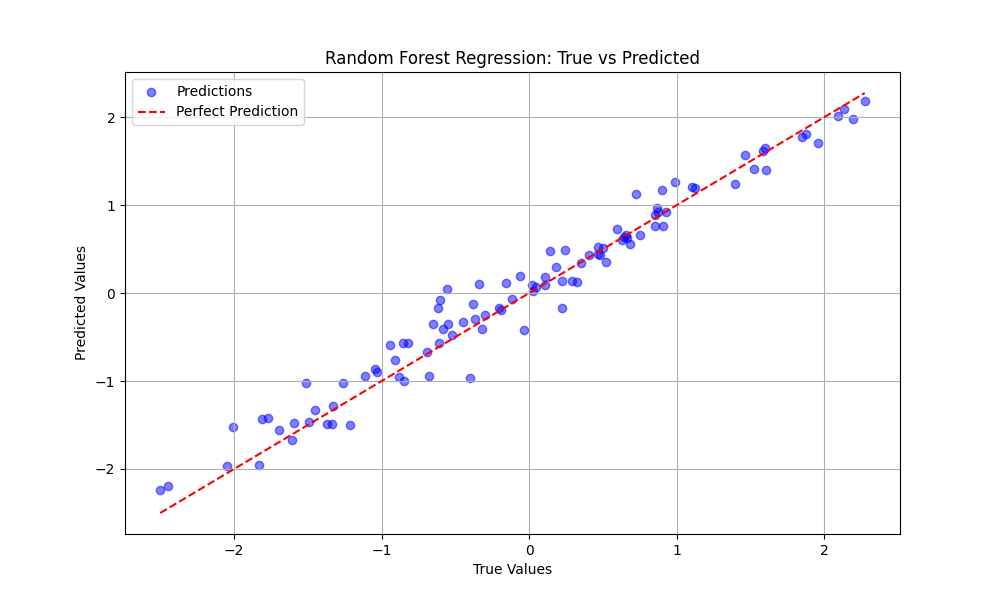

# Random Forest Regressor from Scratch

A Python implementation of a Random Forest Regressor built from scratch using only `numpy`. This project demonstrates the inner workings of decision trees and ensemble learning.

## Features

*   **Decision Tree Regressor**:
    *   Uses Variance Reduction as the splitting criterion.
    *   Supports maximum depth and minimum samples split constraints.
*   **Random Forest Regressor**:
    *   Implements Bagging (Bootstrap Aggregating).
    *   Supports Feature Subsampling (`max_features`) for decorrelating trees.
    *   Aggregates predictions via averaging.
*   **Zero Dependencies**: The core logic relies solely on `numpy`.

## Performance Evaluation

To validate the implementation, we tested the Random Forest Regressor on a synthetic dataset with non-linear interactions and noise.

### Test Setup

*   **Dataset**: Synthetic regression data generated using `numpy`.
*   **Equation**: $y = x_0 + 2x_1 - 3x_2 + 0.5x_1x_2 + \text{noise}$
*   **Samples**: 500 (80% Train, 20% Test)
*   **Features**: 10 (Only first 3 are informative)
*   **Model Parameters**:
    *   `n_estimators`: 20
    *   `max_depth`: 10
    *   `min_samples_split`: 2
    *   `max_features`: 0.8

### Results

The model achieved high accuracy on the test set, demonstrating its ability to capture the underlying patterns despite the noise and irrelevant features.

*   **Mean Squared Error (MSE)**: 0.0458
*   **R² Score**: 0.9631

### Visualization

The scatter plot below shows the Predicted values vs. True values. The proximity of the points to the red dashed line ($y=x$) indicates accurate predictions.

## Project Structure

*   `random_forest/`: Core library package.
    *   `decision_tree.py`: Implementation of a single Decision Tree.
    *   `random_forest.py`: Implementation of the Random Forest ensemble.
*   `test/`: Test scripts.
    *   `test_random_forest.py`: Performance evaluation script.
